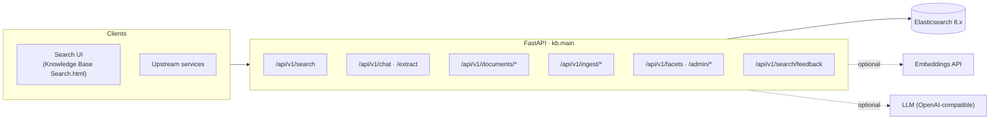
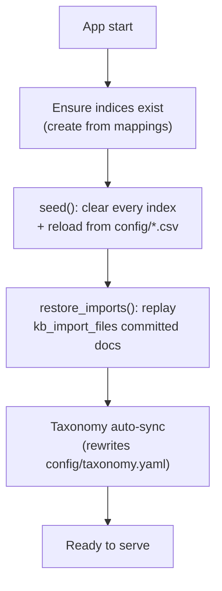

# Architecture Overview

The system is a **retrieval-only** knowledge base. Every searchable byte comes from
a source document; the LLM is a query parser and an explainer, never a generator of
facts. This page is the map — the deep dives live in
[AI Chat Search](ai-chat.md), [Import Pipeline](import-pipeline.md), and
[Search & Ranking](search-ranking.md).

---

## Request surfaces

| Surface | Role | Detail |
|---|---|---|
| `POST /api/v1/search` | Structured hybrid search | [Search & Ranking](search-ranking.md) |
| `POST /api/v1/chat`, `/extract` | Conversational search & NL→params | [AI Chat Search](ai-chat.md) |
| `POST /api/v1/documents/*` | Direct CRUD into the indices | [API Reference](../api-reference.md#documents) |
| `POST /api/v1/ingest/*` | File → reviewed → indexed documents | [Import Pipeline](import-pipeline.md) |
| `GET /api/v1/facets`, `/admin/*` | Live taxonomy + reload | [Configuration](../configuration.md#taxonomy) |
| `POST /api/v1/search/feedback` | 👍/👎 on results (observational) | [Observability](../observability.md#search-feedback) |

---

## The retrieval strategy

Two-stage retrieval, run by `SearchService` (`src/kb/services/search.py`):

1. **Recall** — a keyword (BM25) query over the `body` text field with a
   `title^N` boost. Exact-match **filters** (`project`, `equipment`,
   `error_codes`) narrow the candidate set without affecting relevance.
2. **Ranking** — the top `rrf_window` recall hits are rescored by blending the
   BM25 score with cosine similarity on the `body_vec` dense vector. When the
   embedding service is unavailable, this stage degrades to BM25-only — no error,
   no status change.

The auto pipeline walks **strict → loose → vector-only**, short-circuiting on the
first stage that produces hits, and tags every response with a typed
[`SearchStatus`](search-ranking.md#status-contract). The status is a contract:
upstream callers branch on it (e.g. render a "for reference only" banner on
`loose_hit`).

---

## Indices & documents

Each knowledge type has its own index, addressed through a versioned alias
(`kb_<type>_v1`). Mappings live in `src/kb/es/mappings.py`.

| Knowledge type | Alias | Models (`src/kb/models/document.py`) |
|---|---|---|
| `alarm` | `kb_alarm_v1` | `AlarmDoc` — error codes, cause, resolution |
| `setup` | `kb_setup_v1` | `SetupDoc` — station, procedure, prerequisites |
| `experience` | `kb_experience_v1` | `ExperienceDoc` — problem, failure_desc, body |

Every document carries the common fields `project`, `equipment`, `error_codes`,
`title`, `summary`, `sections`, `source_file`, `source_pages`, plus a `body` text
field (assembled by `src/kb/es/body_builder.py`) and an optional `body_vec`
dense vector.

Two auxiliary indices support operations:

- `kb_import_files` — the import tracker (dedupe + auto-restore). See
  [Import Pipeline → File Tracker](import-pipeline.md#file-tracker-kb_import_files).
- `kb_search_feedback` — observational 👍/👎 signals. See
  [Observability → Search feedback](../observability.md#search-feedback).

---

## Startup lifecycle

`src/kb/main.py` owns the app factory and the startup lifespan:

!!! warning "Always-reseed on startup"
    `seed` clears all documents from every index and reloads from the CSV files on
    **every** server start. Additions, edits, and row deletions in the CSVs all
    take effect automatically on the next restart. Imported documents are not in
    the CSVs — they are restored from the tracker index afterwards.

---

## Configuration & graceful degradation

Settings are layered `config/settings.yaml` → `.env` → shell env vars, validated by
the pydantic-settings `Settings` class in `src/kb/config.py`. See
[Configuration](../configuration.md).

The two external AI services are **optional**:

| Missing key | Effect |
|---|---|
| `KB_LLM__API_KEY` | `/chat` and `/extract` return **503**; all search & indexing still work. Ingest endpoints also return 503 (segmentation needs the LLM). |
| `KB_EMBEDDING__API_KEY` | No vector rescore and no kNN fallback — **BM25-only** keyword search. The server boots normally. |

---

## Design constraints (the non-negotiables)

- **No hallucination** — never add LLM-generated text to search responses. Results
  are verbatim documents or nothing.
- **Taxonomy enforcement** — `project`/`equipment` validated against
  `taxonomy.yaml` at index time. New values require a taxonomy update + re-seed.
- **Banners are a hard contract** — `loose_hit`/`vector_only` carry mandatory
  display banners signalling reduced confidence.
- **Review-gated imports** — no uploaded file reaches the searchable indices until
  a human accepts the staged result. A staged doc that would overwrite an existing KB
  doc is **blocked from commit** until the reviewer resolves the conflict (keep /
  overwrite / merge) — see [Import Pipeline → Conflict detection](import-pipeline.md#conflict-detection).
