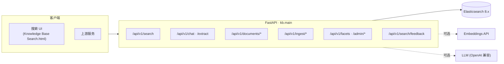
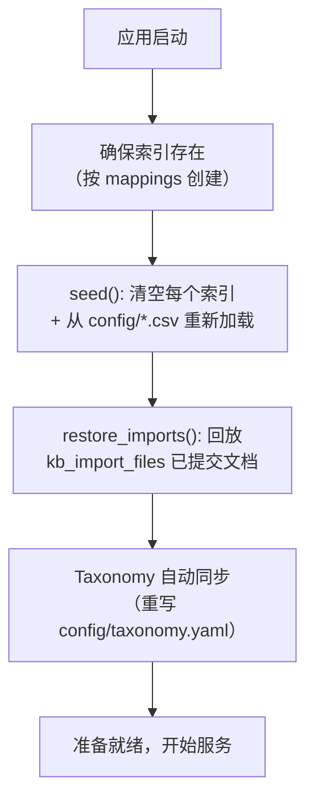

# 架构总览

本系统是一个**纯检索型**知识库。每一个可检索的字节都来自源文档；LLM 是查询解析器和讲解者，从不生成事实。本页是导览图——深入细节见 [AI 对话搜索](ai-chat.zh.md)、[文件导入管道](import-pipeline.zh.md) 与 [检索与排序](search-ranking.zh.md)。

---

## 请求面

| 请求面 | 角色 | 详情 |
|---|---|---|
| `POST /api/v1/search` | 结构化混合检索 | [检索与排序](search-ranking.zh.md) |
| `POST /api/v1/chat`、`/extract` | 对话搜索与 NL→参数 | [AI 对话搜索](ai-chat.zh.md) |
| `POST /api/v1/documents/*` | 直接对索引 CRUD | [API 参考](../api-reference.zh.md#documents) |
| `POST /api/v1/ingest/*` | 文件 → 审核 → 入库文档 | [文件导入管道](import-pipeline.zh.md) |
| `GET /api/v1/facets`、`/admin/*` | 实时 taxonomy + 重载 | [配置](../configuration.zh.md#taxonomy) |
| `POST /api/v1/search/feedback` | 结果 👍/👎（观察用） | [可观测性](../observability.zh.md#search-feedback) |

---

## 检索策略

两阶段检索，由 `SearchService`（`src/kb/services/search.py`）驱动：

1. **召回** —— 在 `body` 文本字段上做关键词（BM25）查询，对 `title` 施加 `title^N` 加权。精确匹配的**过滤条件**（`project`、`equipment`、`error_codes`）收窄候选集，但不影响相关性。
2. **排序** —— 对召回的 top `rrf_window` 命中，将 BM25 分数与 `body_vec` 稠密向量的余弦相似度融合重排。embedding 服务不可用时，本阶段降级为仅 BM25——无报错，状态不变。

auto 管道走 **严格 → 宽松 → 纯向量**，在第一个产出命中的阶段短路返回，并为每个响应打上带类型的 [`SearchStatus`](search-ranking.zh.md#status-contract)。该状态是一项契约：上游调用方据此分支（如在 `loose_hit` 上渲染"仅供参考"banner）。

---

## 索引与文档

每种知识类型拥有独立索引，通过带版本的别名（`kb_<type>_v1`）寻址。映射定义于 `src/kb/es/mappings.py`。

| 知识类型 | 别名 | 模型（`src/kb/models/document.py`） |
|---|---|---|
| `alarm` | `kb_alarm_v1` | `AlarmDoc` —— 报警码、原因、解除流程 |
| `setup` | `kb_setup_v1` | `SetupDoc` —— 工位、流程、前置条件 |
| `experience` | `kb_experience_v1` | `ExperienceDoc` —— 问题、故障描述、正文 |

每个文档都带有公共字段 `project`、`equipment`、`error_codes`、`title`、`summary`、`sections`、`source_file`、`source_pages`，外加一个 `body` 文本字段（由 `src/kb/es/body_builder.py` 拼装）和一个可选的 `body_vec` 稠密向量。

两个辅助索引支撑运维：

- `kb_import_files` —— 导入追踪器（去重 + 自动恢复）。见 [文件导入管道 → 文件追踪器](import-pipeline.zh.md#file-tracker-kb_import_files)。
- `kb_search_feedback` —— 观察用的 👍/👎 信号。见 [可观测性 → 搜索反馈](../observability.zh.md#search-feedback)。

---

## 启动生命周期

`src/kb/main.py` 负责应用工厂与启动生命周期：

!!! warning "启动即重新 seed"
    `seed` 在**每次**启动时清空每个索引的全部文档并从 CSV 重新加载。CSV 的新增、修改、删除行都会在下次重启自动生效。导入文档不在 CSV 中——它们随后从追踪索引恢复。

---

## 配置与优雅降级

设置分层：`config/settings.yaml` → `.env` → shell 环境变量，由 `src/kb/config.py` 的 pydantic-settings `Settings` 类校验。见[配置](../configuration.zh.md)。

两个外部 AI 服务均为**可选**：

| 缺失的密钥 | 影响 |
|---|---|
| `KB_LLM__API_KEY` | `/chat` 与 `/extract` 返回 **503**；搜索与索引照常工作。Ingest 接口也返回 503（切分需要 LLM）。 |
| `KB_EMBEDDING__API_KEY` | 无向量重排、无 kNN 降级——**仅 BM25** 关键词检索。服务正常启动。 |

---

## 设计约束（不可妥协项）

- **禁止幻觉** —— 绝不向搜索响应添加 LLM 生成的文本。结果要么是原文文档，要么什么都没有。
- **Taxonomy 约束** —— `project`/`equipment` 在入库时对照 `taxonomy.yaml` 校验。新值需要更新 taxonomy + 重新 seed。
- **Banner 为强制契约** —— `loose_hit`/`vector_only` 携带必须展示的 banner，提示置信度降低。
- **导入强制人工审核** —— 任何上传文件在人工接受暂存结果前都不会进入可检索索引。会覆盖已有
  KB 文档的暂存文档在审阅者解决冲突（保留 / 覆盖 / 合并）前**被阻断提交** —— 见
  [文件导入管道 → 冲突检测](import-pipeline.zh.md#conflict-detection)。
