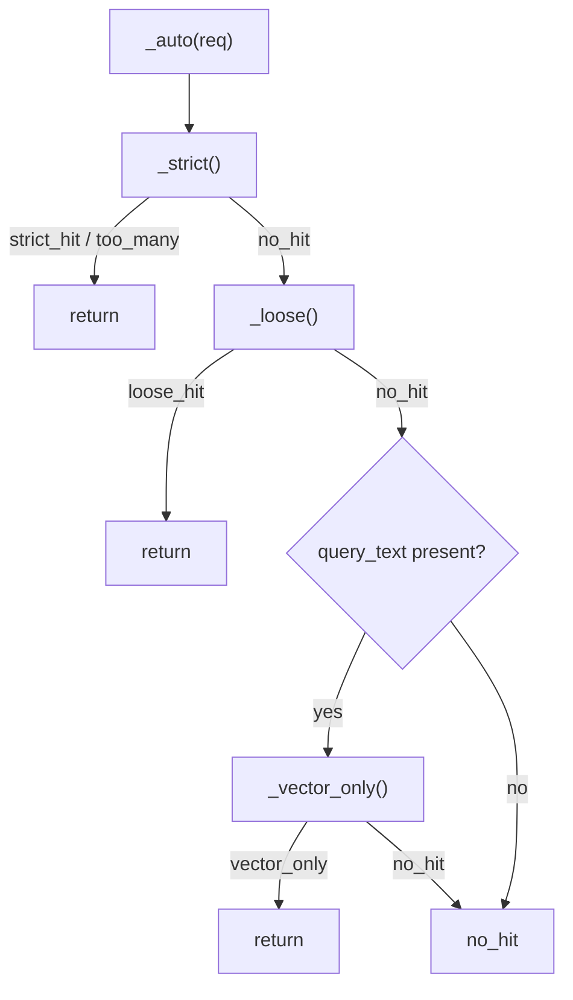

# Search & Ranking

`POST /api/v1/search` is the structured retrieval core. It takes a `SearchRequest`
with exact-match filters and keywords, runs a two-stage recall + ranking pipeline,
and returns a `SearchResponse` tagged with a typed `SearchStatus`. The handler is
`src/kb/api/search.py`; the engine is `src/kb/services/search.py`.

---

## Two-stage retrieval

| Stage | What it does |
|---|---|
| **Recall** | Keyword query (AND for strict, OR for loose) over `body` with a `title^N` boost. Filters are exact-match on keyword fields; they never affect relevance, only inclusion. |
| **Ranking** | The top `rrf_window` recall hits are rescored by blending the BM25 score with cosine vector similarity on `body_vec`. Degrades gracefully to BM25-only when the embedder is down. |
| **vector_only** | Pure kNN (semantic-only, no keyword recall). The last fallback in the auto pipeline when keyword recall returns nothing. |

The recall query (`_bm25_query`) puts the Part-1 fields in a `filter` clause (no
scoring impact) and the keyword `multi_match` in a `must` clause. With no keywords,
`match_all` runs under the filter — returning every doc in scope.

---

## The auto state machine

`mode="auto"` (used by `/chat`) walks the stages and short-circuits on the first
success:



You can also request a single stage directly via `mode="strict"`, `"loose"`, or
`"vector_only"`.

### Stage 1 — Strict (AND-keyword BM25 + vector rescore)

- `multi_match` across `title^{title_boost}` and `body`, operator `AND`.
- Filter clauses (no score impact): `project`, `equipment`, `error_codes`.
- **Gate**: if total hits > `strict_max_hits` (default 8) → return `too_many` with
  facet aggregations and **no documents** — the caller should ask the user to
  narrow down.
- On a hit (≤ `strict_max_hits`): optionally rescore the top `rrf_window` (default
  50) candidates with BM25 + cosine.

### Stage 2 — Loose (OR-keyword BM25 + vector rescore)

- Same query structure but operator `OR` — any keyword match qualifies.
- Same optional rescore step.
- Returns `loose_hit` with the mandatory banner *"没有完全匹配的知识，以下为相关参考，
  仅供参考。"* (no exact match; the following are related references, for reference
  only).

### Stage 3 — Vector-only (pure kNN)

- Only runs if `query_text` is present (the raw last user message).
- ES `knn` on `body_vec`; `k = req.size`, `num_candidates = max(k*4, 100)`.
- Filters (project/equipment/error_codes) still apply.
- Returns `vector_only` with a low-confidence banner.
- Requires the embedding service — silently falls through to `no_hit` if it fails.

---

## The ranking formula {#the-ranking-formula}

When the embedding service is available, stages 1 and 2 apply a rescore pass over
the top `rrf_window` keyword-recall candidates (`_rescore_clause`):

```
final_score = (1 - vector_weight) × BM25_score
            + vector_weight × (cosine_similarity(query_vec, body_vec) + 1)
```

- `vector_weight` defaults to `0.5`; tunable via `KB_SEARCH__VECTOR_WEIGHT`.
- `cosine_sim + 1` maps `[-1, 1]` → `[0, 2]` to keep scores non-negative.
- Docs missing a `body_vec` (seeded without embeddings) score 0 on the vector
  component — guarded in the rescore script so they don't error.

When the embedding service is down, stages 1 and 2 run with BM25 only — no error, no
degraded status flag. The warning is logged and counted as an upstream error metric.

!!! note "Why a rescore window, not native RRF"
    Rescoring only the top `rrf_window` recall candidates keeps the expensive vector
    pass bounded while still re-ordering the head of the result list where it
    matters. The CLAUDE.md shorthand calls this "RRF"; mechanically it is a weighted
    BM25 + cosine blend over the recall window.

---

## Status contract {#status-contract}

Every `POST /api/v1/search` response carries a `status` field. **Do not change these
values** — upstream callers depend on them.

| Status | Condition | Documents returned |
|--------|-----------|--------------------|
| `strict_hit` | All filters + AND-keywords matched, within `strict_max_hits` | Yes |
| `too_many` | Strict matched more than `strict_max_hits` — caller should ask user to narrow | No (facets only) |
| `loose_hit` | Fell back to OR-keywords — show with "for reference only" banner | Yes |
| `vector_only` | Only vector similarity matched — low confidence | Yes |
| `no_hit` | Nothing matched | No |

`loose_hit` and `vector_only` responses carry a non-null `banner` string that
callers **must render verbatim** — it signals reduced confidence to the user.

---

## Faceting on `too_many`

When strict recall overflows `strict_max_hits`, `_facet_counts()` aggregates
`project`, `equipment`, and `error_codes` over the strict-filtered set (top 20
buckets each) so the caller can offer "narrow by…" choices. Each facet also reports
a `facets_truncated[facet]` count (ES `sum_other_doc_count`) — a non-zero value
means the bucket list is not exhaustive.

---

## Index selection

`_index_for()` picks the index to query:

- `knowledge_type` set → the single `kb_<type>_v1` alias.
- `knowledge_type` omitted → a comma-joined search across **all** type aliases.

This is why a chat query without a detected knowledge type still searches alarms,
setups, and experience documents together.

---

## Tunables

All under `search:` in `config/settings.yaml` or `KB_SEARCH__*` env vars. See
[Configuration → Search](../configuration.md#search).

| Parameter | Default | Effect |
|---|---|---|
| `strict_max_hits` | `8` | `too_many` threshold |
| `title_boost` | `3.0` | Title field weight vs body in BM25 |
| `rrf_window` | `50` | How many recall hits are rescored by vector |
| `vector_weight` | `0.5` | Balance between BM25 and cosine in final score |
| `max_result_window` | `10000` | Deepest `from_ + size` page; rejected at the model with a 400 instead of failing inside ES |

To find good values for `title_boost` / `vector_weight` / `rrf_window`, use the
aggregated 👍/👎 signal from the [search feedback](../observability.md#search-feedback)
endpoint.
