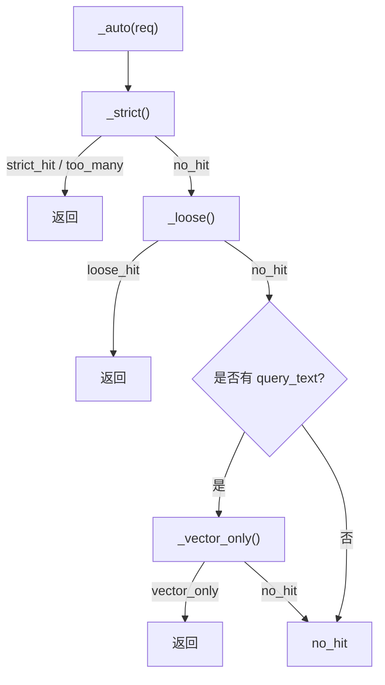

# 检索与排序

`POST /api/v1/search` 是结构化检索核心。它接收带精确匹配过滤条件与关键词的 `SearchRequest`，运行两阶段召回 + 排序管道，返回带类型 `SearchStatus` 的 `SearchResponse`。处理函数位于 `src/kb/api/search.py`；引擎位于 `src/kb/services/search.py`。

---

## 两阶段检索

| 阶段 | 作用 |
|---|---|
| **召回** | 在 `body` 上做关键词查询（严格用 AND，宽松用 OR），对 `title` 施加 `title^N` 加权。过滤条件为关键词字段精确匹配；只影响纳入，不影响相关性。 |
| **排序** | 对召回的 top `rrf_window` 命中，融合 BM25 分数与 `body_vec` 余弦相似度重排。embedder 不可用时降级为仅 BM25。 |
| **vector_only** | 纯 kNN（仅语义，无关键词召回）。auto 管道在关键词召回为空时的最后兜底。 |

召回查询（`_bm25_query`）将 Part-1 字段放入 `filter` 子句（不影响评分），关键词 `multi_match` 放入 `must` 子句。无关键词时在过滤下执行 `match_all`——返回该范围内全部文档。

---

## auto 状态机

`mode="auto"`（被 `/chat` 使用）逐级推进，命中即短路：



也可通过 `mode="strict"`、`"loose"`、`"vector_only"` 直接请求单一阶段。

### 第一级 — 严格（AND 关键词 BM25 + 向量重排）

- `multi_match`，字段 `title^{title_boost}` 与 `body`，operator 为 `AND`。
- 过滤子句（不影响评分）：`project`、`equipment`、`error_codes`。
- **门控**：总命中数 > `strict_max_hits`（默认 8）→ 返回 `too_many` 及分面聚合，**不返回文档**——调用方应引导用户缩小范围。
- 命中（≤ `strict_max_hits`）时：对 top `rrf_window`（默认 50）候选做 BM25 + 余弦重排。

### 第二级 — 宽松（OR 关键词 BM25 + 向量重排）

- 结构相同但 operator 为 `OR`——任意关键词命中即可。
- 同样执行可选重排。
- 返回 `loose_hit`，带强制 banner *"没有完全匹配的知识，以下为相关参考，仅供参考。"*

### 第三级 — 纯向量（kNN）

- 仅在 `query_text` 存在时执行（最后一条原始用户消息）。
- ES `knn` 查询字段 `body_vec`；`k = req.size`，`num_candidates = max(k*4, 100)`。
- project/equipment/error_codes 过滤仍生效。
- 返回 `vector_only`，带低置信度 banner。
- 依赖 embedding 服务——失败时静默降级至 `no_hit`。

---

## 排序公式 {#the-ranking-formula}

当 embedding 服务可用时，第一、二级对召回的 top `rrf_window` 候选执行重排（`_rescore_clause`）：

```
final_score = (1 - vector_weight) × BM25_score
            + vector_weight × (cosine_similarity(query_vec, body_vec) + 1)
```

- `vector_weight` 默认 `0.5`，可通过 `KB_SEARCH__VECTOR_WEIGHT` 调整。
- `cosine_sim + 1` 将 `[-1, 1]` 映射到 `[0, 2]`，确保分数非负。
- 缺少 `body_vec` 的文档（未生成 embedding 时入库）在向量分量上得 0 分——重排脚本对此做了守护，不会报错。

embedding 服务不可用时，第一、二级仅用 BM25——无报错、状态不降级。该 warning 会被记录并计入上游错误指标。

!!! note "为什么是重排窗口，而非原生 RRF"
    仅对召回的 top `rrf_window` 候选重排，可在重排序最关键的结果头部的同时，约束昂贵的向量计算。CLAUDE.md 中将其简称为 "RRF"；机制上它是召回窗口内 BM25 + 余弦的加权融合。

---

## 状态契约 {#status-contract}

每个 `POST /api/v1/search` 响应都携带 `status` 字段。**不要改动这些取值**——上游调用方依赖它们。

| 状态 | 触发条件 | 是否返回文档 |
|--------|-----------|--------------------|
| `strict_hit` | 全部过滤 + AND 关键词命中，且在 `strict_max_hits` 内 | 是 |
| `too_many` | 严格命中超过 `strict_max_hits`——调用方应引导用户缩小 | 否（仅分面） |
| `loose_hit` | 降级到 OR 关键词——展示时附"仅供参考"banner | 是 |
| `vector_only` | 仅向量相似度命中——低置信度 | 是 |
| `no_hit` | 全部未命中 | 否 |

`loose_hit` 与 `vector_only` 响应携带非空 `banner` 字符串，调用方**必须原文渲染**——它向用户明示置信度降低。

---

## `too_many` 时的分面

当严格召回超过 `strict_max_hits`，`_facet_counts()` 在严格过滤后的结果集上聚合 `project`、`equipment`、`error_codes`（各取前 20 桶），供调用方提供"按…缩小"选项。每个分面还报告一个 `facets_truncated[facet]` 计数（ES `sum_other_doc_count`）——非零值意味着桶列表不完整。

---

## 索引选择

`_index_for()` 选择要查询的索引：

- 设置了 `knowledge_type` → 单个 `kb_<type>_v1` 别名。
- 省略 `knowledge_type` → 跨**所有**类型别名的逗号连接查询。

这就是为什么一个未检测到知识类型的对话查询仍能同时检索报警、setup 与经验文档。

---

## 可调项

全部位于 `config/settings.yaml` 的 `search:` 段或 `KB_SEARCH__*` 环境变量。见[配置 → Search](../configuration.md#search)。

| 参数 | 默认值 | 作用 |
|---|---|---|
| `strict_max_hits` | `8` | `too_many` 阈值 |
| `title_boost` | `3.0` | BM25 中标题相对正文的权重 |
| `rrf_window` | `50` | 参与向量重排的召回命中数 |
| `vector_weight` | `0.5` | 最终评分中 BM25 与余弦的平衡 |
| `max_result_window` | `10000` | 最深 `from_ + size` 页；在模型层用 400 拒绝，而非在 ES 内部失败 |

要找到 `title_boost` / `vector_weight` / `rrf_window` 的合适取值，请使用[搜索反馈](../observability.md#search-feedback)接口聚合的 👍/👎 信号。
