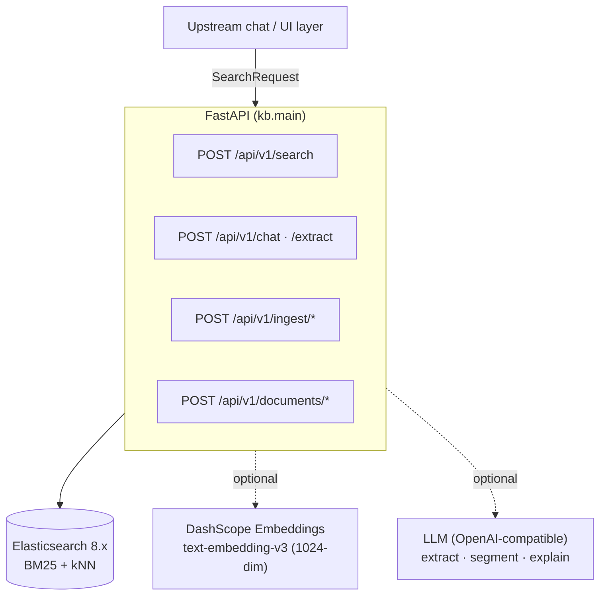

# Knowledge Base — Manufacturing Search Engine

A **precision information-retrieval service for manufacturing knowledge**. Built on
Elasticsearch with hybrid BM25 + vector search — **not RAG, not generative AI**.
Documents are returned **verbatim or not at all**.

!!! quote "Why not RAG?"
    In manufacturing, alarm codes differ by one character, equipment parameters
    are meaningless without domain context, and wrong answers have real
    consequences. This system is designed around a **zero-fabrication
    guarantee**: if a document matches, it is shown as-is; if nothing matches,
    the caller is told so explicitly. The LLM is used only as a query-understanding
    proxy and a conversational explainer — never as a source of facts.

---

## What this project is

A zero-fabrication knowledge-base API for semiconductor manufacturing equipment.
Documents are retrieved verbatim from Elasticsearch; the system never generates
document text. The LLM appears in exactly two roles:

- **Query-understanding proxy** (`POST /api/v1/extract`) — turns a free-text
  question into structured search parameters.
- **Conversational search assistant** (`POST /api/v1/chat`) — extracts params,
  searches the KB, and answers strictly from the returned documents.

**Stack:** FastAPI · Elasticsearch 8.x (IK analyzer plugin) · pydantic-settings ·
httpx · DashScope Embeddings API (optional).

---

## The three guarantees

-   :material-shield-check: **Zero fabrication**

    Search responses contain verbatim document sections or nothing. The LLM is
    forbidden from inventing parameters, steps, or alarm codes.

-   :material-tune-variant: **Graceful degradation**

    No LLM key → search and indexing still work (AI chat returns 503).
    No embedding key → keyword-only BM25 search, no kNN. The server always boots.

-   :material-format-list-checks: **Taxonomy enforcement**

    `project` and `equipment` values are validated against
    [`config/taxonomy.yaml`](configuration.md#taxonomy) at index time. Unknown
    values are rejected rather than silently stored.

---

## Where to go next

| If you want to… | Read |
|---|---|
| Run the stack and try it out | [Getting Started](getting-started.md) |
| Understand the big picture | [Architecture → Overview](architecture/overview.md) |
| Understand the chat/extract endpoints | [Architecture → AI Chat Search](architecture/ai-chat.md) |
| Understand how files become documents | [Architecture → Import Pipeline](architecture/import-pipeline.md) |
| Understand the search ranking & status contract | [Architecture → Search & Ranking](architecture/search-ranking.md) |
| Tune settings / add a provider | [Configuration](configuration.md) |
| Call the HTTP API | [API Reference](api-reference.md) |
| Wire up metrics & logs | [Observability](observability.md) |
| Rebuild the system from scratch | [Reference → Build from Scratch](reference/build-from-scratch.md) |
| Look up every field & ES mapping | [Reference → Data Model](reference/data-model.md) |
| Look up every setting & env var | [Reference → Configuration Reference](reference/configuration-reference.md) |
| Deploy, back up & harden | [Operations → Deployment](operations/deployment.md) |
| Run the tests / develop | [Operations → Testing & Development](operations/testing.md) |
| Diagnose a failure | [Operations → Troubleshooting](operations/troubleshooting.md) |
| Understand the security posture | [Operations → Security](operations/security.md) |

---

## At a glance

Structured filters narrow the candidate set first, then hybrid BM25 keyword search
and dense-vector similarity re-rank results. The caller never sees AI-generated
text — only verbatim document sections.
