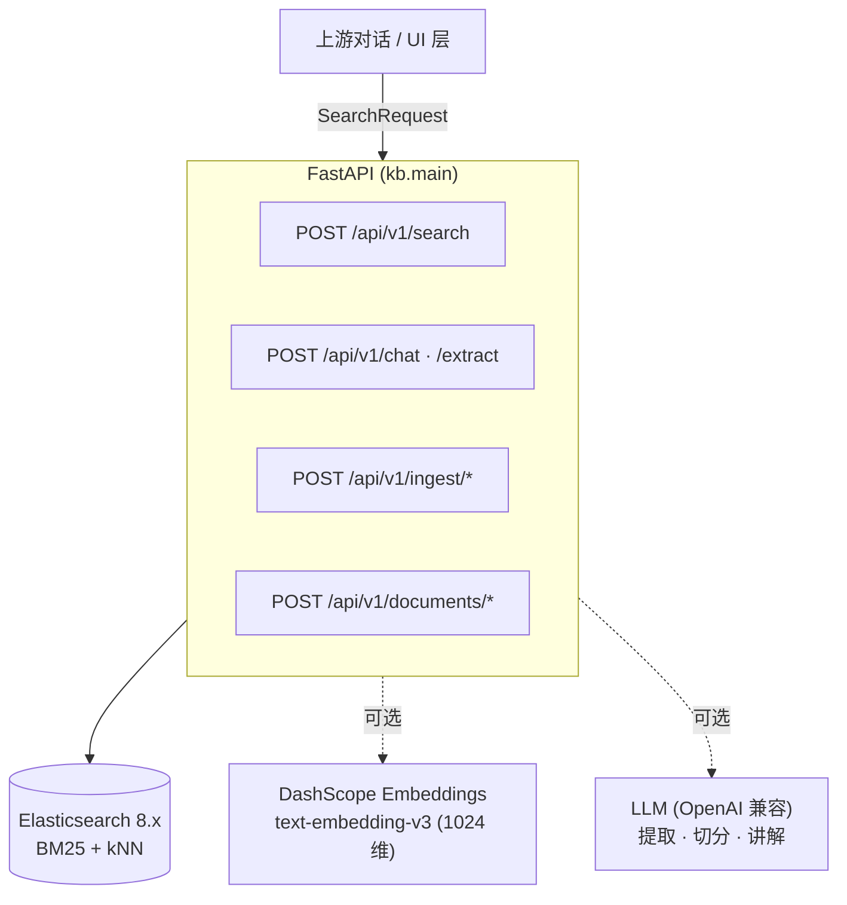

# 知识库 — 制造业搜索引擎

一个面向制造业知识的**精准信息检索服务**。基于 Elasticsearch，采用 BM25 + 向量混合检索——**不是 RAG，不是生成式 AI**。文档要么**原文返回，要么不返回**。

!!! quote "为什么不用 RAG？"
    在制造业中，一个字符之差就是另一个报警码，设备参数脱离领域上下文便毫无意义，而错误答案会带来真实后果。本系统围绕**零编造保证**设计：文档命中即原样展示；若无匹配，则明确告知调用方。LLM 仅作为查询理解代理和对话式讲解者——**绝不**作为事实来源。

---

## 本项目是什么

一个面向半导体制造设备的零编造知识库 API。文档从 Elasticsearch 原文检索；系统从不生成文档文本。LLM 恰好担任两个角色：

- **查询理解代理**（`POST /api/v1/extract`）—— 将自由文本问题转为结构化检索参数。
- **对话式搜索助手**（`POST /api/v1/chat`）—— 提取参数、检索知识库，并严格基于返回文档作答。

**技术栈**：FastAPI · Elasticsearch 8.x（IK 分词插件）· pydantic-settings · httpx · DashScope Embeddings API（可选）。

---

## 三大保证

-   :material-shield-check: **零编造**

    搜索响应只包含原文文档片段，或什么都不返回。禁止 LLM 编造参数、步骤或报警码。

-   :material-tune-variant: **优雅降级**

    无 LLM 密钥 → 搜索与索引照常工作（AI 对话返回 503）。无 embedding 密钥 → 仅 BM25 关键词检索，无 kNN。服务始终能启动。

-   :material-format-list-checks: **Taxonomy 约束**

    `project` 与 `equipment` 在入库时对照 [`config/taxonomy.yaml`](configuration.zh.md#taxonomy) 校验。未知值被拒绝，而非静默入库。

---

## 下一步去哪

| 你想… | 阅读 |
|---|---|
| 运行整套服务并试用 | [快速开始](getting-started.zh.md) |
| 了解整体架构 | [架构 → 总览](architecture/overview.zh.md) |
| 了解 chat/extract 接口 | [架构 → AI 对话搜索](architecture/ai-chat.zh.md) |
| 了解文件如何变成文档 | [架构 → 文件导入管道](architecture/import-pipeline.zh.md) |
| 了解检索排序与状态契约 | [架构 → 检索与排序](architecture/search-ranking.zh.md) |
| 调参 / 接入新的 Provider | [配置](configuration.zh.md) |
| 调用 HTTP API | [API 参考](api-reference.zh.md) |
| 接入指标与日志 | [可观测性](observability.zh.md) |
| 从零重建整个系统 | [参考 → 从零搭建](reference/build-from-scratch.zh.md) |
| 查阅每个字段与 ES 映射 | [参考 → 数据模型](reference/data-model.zh.md) |
| 查阅每项设置与环境变量 | [参考 → 配置参考](reference/configuration-reference.zh.md) |
| 部署、备份与加固 | [运维 → 部署](operations/deployment.zh.md) |
| 运行测试 / 开发 | [运维 → 测试与开发](operations/testing.zh.md) |
| 诊断故障 | [运维 → 故障排查](operations/troubleshooting.zh.md) |
| 了解安全态势 | [运维 → 安全](operations/security.zh.md) |

---

## 一图概览

结构化过滤先收窄候选集，随后 BM25 关键词检索与稠密向量相似度共同重排。调用方永远看不到 AI 生成的文本——只有原文文档片段。
