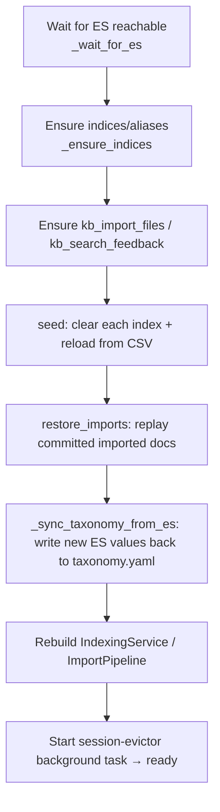

# Replication / Build-from-scratch Guide {#build-from-scratch}

This page is the **step-by-step replication** path from an empty directory to a running
service, with each step linked to its source and config. Goal: rebuild a
behaviourally-equivalent system from docs alone. To just run the existing repo, see
[Getting Started](../getting-started.md); this page targets *re-implementation*.

---

## 0. Stack & prerequisites {#prerequisites}

| Component | Version / notes |
|---|---|
| Python | ≥ 3.12 |
| Package manager | [uv](https://docs.astral.sh/uv/) (repo pins via `uv.lock`) |
| Web framework | FastAPI + uvicorn[standard] |
| Search engine | Elasticsearch 8.x (8.15.3 recommended) + the `analysis-ik` plugin |
| Validation/config | pydantic ≥2.9 + pydantic-settings ≥2.6 |
| HTTP client | httpx; retries via tenacity |
| Metrics | prometheus-client |
| LLM / embeddings | any OpenAI-compatible API (default DashScope qwen-plus / text-embedding-v3) |
| File parsing (optional `ingest`) | pymupdf, openpyxl, python-pptx, python-docx, Pillow |
| OCR (optional `ocr`) | paddleocr, paddlepaddle |
| Docs site (optional `docs`) | mkdocs-material, mkdocs-static-i18n |

Both LLM and embeddings are **optional**: no embeddings → BM25-only; no LLM → AI
chat/extract/import-segmentation disabled. ES is the core dependency.

---

## 1. Project skeleton {#layout}

```
.
├── pyproject.toml              # deps + extras (dev/ingest/ocr/docs)
├── Dockerfile                  # app image (multi-stage uv build, INSTALL_OCR switch)
├── docker-compose.yml          # full stack: elasticsearch + app
├── elasticsearch/Dockerfile    # custom ES image (installs analysis-ik plugin)
├── .env.example                # env var template (copy to .env)
├── Knowledge Base Search.html  # frontend SPA (GET / returns it)
├── config/
│   ├── settings.yaml           # runtime defaults
│   ├── taxonomy.yaml           # taxonomy (projects/equipment/knowledge_types)
│   ├── knowledge_types/        # alarm.yaml / setup.yaml / experience.yaml
│   ├── 机台报警_header.csv      # alarm seed data
│   ├── 机台setup_header.csv     # setup seed data
│   └── 设备经验_header.csv      # experience seed data
└── src/kb/
    ├── __main__.py             # python -m kb entry point
    ├── main.py                 # FastAPI factory + startup lifespan
    ├── config.py               # Settings schema
    ├── api/                    # routers: search/chat/documents/ingest/facets/feedback/deps
    ├── es/                     # client/mappings/migrations/body_builder/*mappings
    ├── models/                 # document/search/ingest/taxonomy
    ├── services/               # search/seed/indexing/embedding/llm/segmentation/extraction/…
    └── observability/          # logging_config/metrics/middleware
```

Per-file roles are in the Key files table of the [Architecture Overview](../architecture/overview.md);
data contracts in the [Data Model Reference](data-model.md); settings in the
[Full Configuration Reference](configuration-reference.md).

---

## 2. Dependency declaration {#dependencies}

`pyproject.toml` core deps:

```toml
[project]
requires-python = ">=3.12"
dependencies = [
    "fastapi>=0.115", "uvicorn[standard]>=0.32",
    "elasticsearch[async]>=8.15,<9",
    "pydantic>=2.9", "pydantic-settings>=2.6",
    "httpx>=0.27", "pyyaml>=6.0", "tenacity>=9.0",
    "python-multipart>=0.0.9", "prometheus-client>=0.21",
]
[project.optional-dependencies]
ingest = ["pymupdf>=1.24", "openpyxl>=3.1", "python-pptx>=0.6.23", "python-docx>=1.1", "Pillow>=10.0"]
ocr    = ["paddleocr>=2.10.0", "paddlepaddle>=3.3.1"]
docs   = ["mkdocs-material>=9.5", "mkdocs-static-i18n>=1.2"]
```

Build backend is hatchling, packaging `src/kb`. Install:

```bash
uv sync                      # base
uv sync --extra ingest       # + file parsing
uv sync --extra ingest --extra ocr --extra dev   # full dev
```

---

## 3. Start Elasticsearch (with the IK analyzer) {#elasticsearch}

`elasticsearch/Dockerfile` — installs the IK plugin onto the official image:

```dockerfile
FROM docker.elastic.co/elasticsearch/elasticsearch:8.15.3
RUN bin/elasticsearch-plugin install --batch \
    https://release.infinilabs.com/analysis-ik/stable/elasticsearch-analysis-ik-8.15.3.zip
```

The `elasticsearch` service in `docker-compose.yml` runs single-node, security off, 1G
heap, with a healthcheck (waits for `status` green/yellow).

```bash
docker compose up -d --build elasticsearch
```

!!! tip "Works without the IK plugin"
    On a vanilla ES (no plugin), set both `KB_ES__ANALYZER_INDEX` and
    `KB_ES__ANALYZER_QUERY` to `cjk` (built-in bigram analysis). The mapping code skips
    the custom-analyzer settings block automatically.

---

## 4. Config files {#config-files}

### `config/settings.yaml`

Runtime defaults (overridable by `.env`/env vars, see
[Config Reference § precedence](configuration-reference.md#precedence)). Key blocks:
`es` (url, analyzer), `embedding`, `search` (strict_max_hits, title_boost, rrf_window,
vector_weight), `ingest`, `llm`, `observability`.

### `.env`

```bash
cp .env.example .env
# fill in (needed to enable AI/vector):
KB_LLM__API_KEY=sk-...
KB_EMBEDDING__API_KEY=sk-...
```

### `config/taxonomy.yaml`

Taxonomy — single source of truth for filterable enums:

```yaml
version: "2026-05-19-r1"
knowledge_types: [alarm, setup, experience]
projects: [Kinneret, MEM, MHK, PDX, Boston, Sonora, Yucatan, 所有项目]
equipment: [Aligner, Conveyor, FTU, Heater, Loader, Pump, SensorModule, Stage]
```

Validation rules in [Data Model § Taxonomy model](data-model.md#taxonomy-model). This
file is rewritten by the startup auto-sync, so it must be writable.

### `config/knowledge_types/*.yaml`

One spec file per knowledge type, the single source of truth for the LLM segmentation
prompt. Schema in [Data Model § Knowledge-type spec](data-model.md#type-spec), with
fields, boundary hints, confidence guide, skip rules, and a worked example. All three
(alarm/setup/experience) are required.

### Seed CSVs

Three UTF-8-BOM CSVs with Chinese column headers (headers in
[Data Model § CSV mapping](data-model.md#csv-mapping)). Cleared and reloaded on every
startup.

---

## 5. Implementation order (by dependency) {#implementation}

1. **Config** (`config.py`): define `Settings` with pydantic-settings; override
   `settings_customise_sources` for env > .env > yaml precedence; wrap `get_settings()`
   in `lru_cache`.
2. **Models** (`models/`): see the [Data Model Reference](data-model.md) — document
   subclasses, search/import models, taxonomy.
3. **ES layer** (`es/`): `mappings.py` (`dynamic: strict`; keyword/text/dense_vector),
   `body_builder.py` (the pinned `body` layout), `migrations.py` (versioned indices +
   atomic alias swap), `client.py` (async singleton), `import_mappings.py` /
   `feedback_mappings.py`.
4. **Services** (`services/`):
   - `embedding.py` / `llm.py`: OpenAI-compatible HTTP clients + tenacity retries.
   - `indexing.py`: `validate_against_taxonomy` → `build_body` → `embed` → bulk write;
     content-addressed `doc_id`.
   - `search.py`: strict→loose→vector_only state machine + the rescore formula (see
     [Search & Ranking](../architecture/search-ranking.md)).
   - `csv_loader.py` + `seed.py`: CSV → docs → validate → embed → bulk; `restore_imports`.
   - `extraction.py` / `segmentation.py` / `import_pipeline.py` / `file_tracker.py` /
     `ocr.py` / `spec.py`: the import pipeline (see [Import Pipeline](../architecture/import-pipeline.md)).
5. **API** (`api/`): FastAPI routers + `deps.py` dependency injection (services pulled
   from `app.state`).
6. **Observability** (`observability/`): request-id middleware, Prometheus metrics,
   structured logging.
7. **App factory** (`main.py`): `create_app()` wires middleware, routers, exception
   handlers, health checks; `lifespan` does ensure-indices → seed → restore → taxonomy
   sync → background evictor.

---

## 6. Startup sequence (lifespan) {#startup}

`main.py`'s `lifespan` runs before the service is ready (`_wait_for_es` first pings with
exponential backoff):



If ES is unreachable it starts DEGRADED: the service comes up but search/index fail until
ES recovers.

!!! warning "Always-reseed on startup"
    `seed()` **clears every main index and reloads from the CSVs** — additions, edits,
    and deletions in the CSVs all take effect on the next restart. Imported documents are
    not in the CSVs; `restore_imports()` restores them from `kb_import_files`.

---

## 7. Run & verify {#run-verify}

```bash
# full stack (simplest)
docker compose up -d --build           # app on :8000

# or run app locally (ES still via compose)
docker compose up -d --build elasticsearch
uv run python -m kb --reload

# health
curl localhost:8000/healthz            # {"status":"ok"}
curl localhost:8000/readyz             # probes ES; deep=true also probes embeddings
curl localhost:8000/readyz?deep=true

# one search
curl -s localhost:8000/api/v1/search -H 'content-type: application/json' \
  -d '{"keywords":["真空"],"mode":"auto","size":5}' | jq

# taxonomy
curl -s localhost:8000/api/v1/facets | jq
```

Tests:

```bash
uv run pytest tests/unit                         # no infra
uv run --extra ingest pytest tests/unit          # incl. PPTX/PDF extraction
uv run pytest tests/integration -m integration   # needs Docker
uv run ruff check src tests                       # lint
uv run mypy src                                   # type check
```

PPTX/PDF fixtures are generated on-the-fly by `tests/unit/conftest.py` from the seed
CSVs — no large binaries are committed.

---

## 8. Image build (with the OCR switch) {#docker}

`Dockerfile` is multi-stage: the builder reproduces deps from `uv.lock` with uv
(includes the `ingest` extra by default); the runtime copies the venv + `config/` + the
frontend HTML, uses tini as PID 1, and a `HEALTHCHECK` hitting `/readyz`.

```bash
docker build -t kb-app .                              # slim (no OCR)
docker build -t kb-app --build-arg INSTALL_OCR=true . # with PaddleOCR (~+1.5–2GB)
```

Compose bind-mounts `./config` and `./data/uploads` (so CSV edits and the taxonomy
auto-sync persist), and overrides the network address with
`KB_ES__URL=http://elasticsearch:9200`. API keys come from `.env` (missing keys only
disable the matching features).

---

## 9. Replication checklist {#checklist}

- [ ] ES 8.x up and (recommended) IK installed; otherwise analyzers set to `cjk`
- [ ] Three seed CSVs + three `knowledge_types/*.yaml` + `taxonomy.yaml` present and writable
- [ ] `KB_EMBEDDING__DIMS` equals the embedding model's dimension (default 1024)
- [ ] `.env` filled (or deliberately empty to verify degradation) with LLM/embedding keys
- [ ] `GET /readyz` returns 200; `GET /readyz?deep=true` reports embedding `ok`
- [ ] `POST /api/v1/search` returns results with the right `status`
- [ ] `POST /api/v1/chat` (with an LLM key) extracts → searches → answers
- [ ] Imported docs survive a restart (`restore_imports` works)
