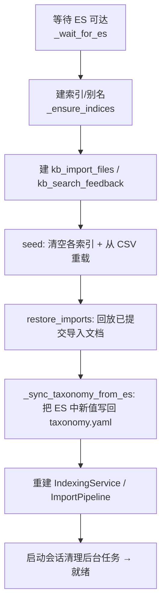

# 从零复现指南 {#build-from-scratch}

本页给出从空目录到可运行服务的**逐步复现**路径，并标注每一步对应的源码与配置文件。
目标：仅凭文档即可重建一个行为等价的系统。运行已有仓库只需看
[快速开始](../getting-started.md)；本页面向"重新实现"。

---

## 0. 技术栈与前置 {#prerequisites}

| 组件 | 版本 / 说明 |
|---|---|
| Python | ≥ 3.12 |
| 包管理 | [uv](https://docs.astral.sh/uv/)（仓库用 `uv.lock` 锁定） |
| Web 框架 | FastAPI + uvicorn[standard] |
| 检索引擎 | Elasticsearch 8.x（建议 8.15.3） + `analysis-ik` 插件 |
| 校验/配置 | pydantic ≥2.9 + pydantic-settings ≥2.6 |
| HTTP 客户端 | httpx；重试用 tenacity |
| 指标 | prometheus-client |
| LLM / 嵌入 | 任意 OpenAI 兼容 API（默认 DashScope 的 qwen-plus / text-embedding-v3） |
| 文件解析（可选 `ingest`） | pymupdf、openpyxl、python-pptx、python-docx、Pillow |
| OCR（可选 `ocr`） | paddleocr、paddlepaddle |
| 文档站（可选 `docs`） | mkdocs-material、mkdocs-static-i18n |

LLM 与嵌入都是**可选**的：缺嵌入 → 仅 BM25；缺 LLM → 关闭 AI 聊天/抽取/导入分段。
ES 是核心依赖。

---

## 1. 项目骨架 {#layout}

```
.
├── pyproject.toml              # 依赖 + extras（dev/ingest/ocr/docs）
├── Dockerfile                  # app 镜像（多阶段 uv 构建，INSTALL_OCR 开关）
├── docker-compose.yml          # 全栈：elasticsearch + app
├── elasticsearch/Dockerfile    # 自定义 ES 镜像（装 analysis-ik 插件）
├── .env.example                # 环境变量模板（复制为 .env）
├── Knowledge Base Search.html  # 前端单页（GET / 返回它）
├── config/
│   ├── settings.yaml           # 运行时默认
│   ├── taxonomy.yaml           # 分类法（项目/设备/知识类型）
│   ├── knowledge_types/        # alarm.yaml / setup.yaml / experience.yaml
│   ├── 机台报警_header.csv      # 报警种子数据
│   ├── 机台setup_header.csv     # 调试种子数据
│   └── 设备经验_header.csv      # 经验种子数据
└── src/kb/
    ├── __main__.py             # python -m kb 入口
    ├── main.py                 # FastAPI 工厂 + 启动 lifespan
    ├── config.py               # Settings schema
    ├── api/                    # 路由：search/chat/documents/ingest/facets/feedback/deps
    ├── es/                     # client/mappings/migrations/body_builder/*mappings
    ├── models/                 # document/search/ingest/taxonomy
    ├── services/               # search/seed/indexing/embedding/llm/segmentation/extraction/…
    └── observability/          # logging_config/metrics/middleware
```

各文件职责见 [架构总览](../architecture/overview.md) 的 Key files 表；数据契约见
[数据模型参考](data-model.md)；配置项见 [配置项完整参考](configuration-reference.md)。

---

## 2. 依赖声明 {#dependencies}

`pyproject.toml` 核心依赖：

```toml
[project]
requires-python = ">=3.12"
dependencies = [
    "fastapi>=0.115", "uvicorn[standard]>=0.32",
    "elasticsearch[async]>=8.15,<9",
    "pydantic>=2.9", "pydantic-settings>=2.6",
    "httpx>=0.27", "pyyaml>=6.0", "tenacity>=9.0",
    "python-multipart>=0.0.9", "prometheus-client>=0.21",
]
[project.optional-dependencies]
ingest = ["pymupdf>=1.24", "openpyxl>=3.1", "python-pptx>=0.6.23", "python-docx>=1.1", "Pillow>=10.0"]
ocr    = ["paddleocr>=2.10.0", "paddlepaddle>=3.3.1"]
docs   = ["mkdocs-material>=9.5", "mkdocs-static-i18n>=1.2"]
```

构建后端用 hatchling，打包 `src/kb`。安装：

```bash
uv sync                      # 基础
uv sync --extra ingest       # 加文件解析
uv sync --extra ingest --extra ocr --extra dev   # 全量开发
```

---

## 3. 启动 Elasticsearch（含 IK 分词器） {#elasticsearch}

`elasticsearch/Dockerfile`——在官方镜像上装 IK 插件：

```dockerfile
FROM docker.elastic.co/elasticsearch/elasticsearch:8.15.3
RUN bin/elasticsearch-plugin install --batch \
    https://release.infinilabs.com/analysis-ik/stable/elasticsearch-analysis-ik-8.15.3.zip
```

`docker-compose.yml` 的 `elasticsearch` 服务以单节点、关安全、1G 堆运行，并带
健康检查（等 `status` 为 green/yellow）。

```bash
docker compose up -d --build elasticsearch
```

!!! tip "没有 IK 插件也能跑"
    若用裸 ES（无插件），把 `KB_ES__ANALYZER_INDEX` 与 `KB_ES__ANALYZER_QUERY` 都设为
    `cjk`（内置二元分词）。映射代码会自动跳过自定义分析器 settings 块。

---

## 4. 配置文件 {#config-files}

### `config/settings.yaml`

运行时默认（可被 `.env`/环境变量覆盖，见 [配置项参考 § 优先级](configuration-reference.md#precedence)）。
关键块：`es`（url、analyzer）、`embedding`、`search`（strict_max_hits、title_boost、
rrf_window、vector_weight）、`ingest`、`llm`、`observability`。

### `.env`

```bash
cp .env.example .env
# 填入（启用 AI/向量所需）：
KB_LLM__API_KEY=sk-...
KB_EMBEDDING__API_KEY=sk-...
```

### `config/taxonomy.yaml`

分类法——可过滤枚举的单一事实源：

```yaml
version: "2026-05-19-r1"
knowledge_types: [alarm, setup, experience]
projects: [Kinneret, MEM, MHK, PDX, Boston, Sonora, Yucatan, 所有项目]
equipment: [Aligner, Conveyor, FTU, Heater, Loader, Pump, SensorModule, Stage]
```

校验规则见 [数据模型 § 分类法模型](data-model.md#taxonomy-model)。该文件运行时会被
启动自动同步改写，须可写。

### `config/knowledge_types/*.yaml`

每个知识类型一个规格文件，是 LLM 分段提示词的单一事实源。schema 见
[数据模型 § 知识类型规格](data-model.md#type-spec)，含字段、边界提示、置信度指南、
跳过规则与样例。三个文件（alarm/setup/experience）缺一不可。

### 种子 CSV

三个 UTF-8-BOM 编码的 CSV，列名为中文（表头见
[数据模型 § CSV 映射](data-model.md#csv-mapping)）。启动时每次清空并重载。

---

## 5. 实现要点（按依赖顺序） {#implementation}

1. **配置**（`config.py`）：用 pydantic-settings 定义 `Settings`，自定义
   `settings_customise_sources` 实现 env > .env > yaml 优先级；`get_settings()` 加
   `lru_cache`。
2. **模型**（`models/`）：见 [数据模型参考](data-model.md)——文档子类、检索/导入模型、
   分类法。
3. **ES 层**（`es/`）：`mappings.py`（`dynamic: strict`、keyword/text/dense_vector）、
   `body_builder.py`（钉死的 `body` 拼装格式）、`migrations.py`（版本化索引 + 原子别名
   切换）、`client.py`（异步单例）、`import_mappings.py` / `feedback_mappings.py`。
4. **服务**（`services/`）：
   - `embedding.py` / `llm.py`：OpenAI 兼容 HTTP 客户端 + tenacity 重试。
   - `indexing.py`：`validate_against_taxonomy` → `build_body` → `embed` → bulk 写入；
     `doc_id` 内容寻址。
   - `search.py`：strict→loose→vector_only 状态机 + rescore 公式（见
     [检索与排序](../architecture/search-ranking.md)）。
   - `csv_loader.py` + `seed.py`：CSV → 文档 → 校验 → 嵌入 → bulk；`restore_imports`。
   - `extraction.py` / `segmentation.py` / `import_pipeline.py` / `file_tracker.py` /
     `ocr.py` / `spec.py`：导入管道（见 [文件导入管道](../architecture/import-pipeline.md)）。
5. **API**（`api/`）：FastAPI 路由 + `deps.py` 依赖注入（从 `app.state` 取服务）。
6. **可观测性**（`observability/`）：请求 ID 中间件、Prometheus 指标、结构化日志。
7. **应用工厂**（`main.py`）：`create_app()` 装中间件、路由、异常处理器、健康检查；
   `lifespan` 负责建索引→seed→restore→分类法同步→后台清理器。

---

## 6. 启动顺序（lifespan） {#startup}

`main.py` 的 `lifespan` 在服务就绪前执行（`_wait_for_es` 先做指数退避探活）：



ES 不可达时进入 DEGRADED 模式：服务仍起，但检索/索引失败直到 ES 恢复。

!!! warning "每次启动都重排（reseed）"
    `seed()` 会**清空每个主索引并从 CSV 重载**——CSV 的增、改、删都在下次重启生效。
    导入的文档不在 CSV 里，由 `restore_imports()` 从 `kb_import_files` 恢复。

---

## 7. 运行与验证 {#run-verify}

```bash
# 全栈（最简）
docker compose up -d --build           # app 在 :8000

# 或本地起 app（ES 仍用 compose）
docker compose up -d --build elasticsearch
uv run python -m kb --reload

# 健康检查
curl localhost:8000/healthz            # {"status":"ok"}
curl localhost:8000/readyz             # 探 ES；deep=true 再探嵌入
curl localhost:8000/readyz?deep=true

# 一次检索
curl -s localhost:8000/api/v1/search -H 'content-type: application/json' \
  -d '{"keywords":["真空"],"mode":"auto","size":5}' | jq

# 分类法
curl -s localhost:8000/api/v1/facets | jq
```

测试：

```bash
uv run pytest tests/unit                         # 无需基础设施
uv run --extra ingest pytest tests/unit          # 含 PPTX/PDF 抽取
uv run pytest tests/integration -m integration   # 需 Docker
uv run ruff check src tests                       # 静态检查
uv run mypy src                                   # 类型检查
```

PPTX/PDF 测试夹具由 `tests/unit/conftest.py` 用种子 CSV 即时生成，仓库不提交大二进制。

---

## 8. 镜像构建（含 OCR 开关） {#docker}

`Dockerfile` 多阶段：builder 用 uv 从 `uv.lock` 复现依赖（默认含 `ingest` extra），
runtime 拷贝 venv + `config/` + 前端 HTML，PID-1 用 tini，`HEALTHCHECK` 打 `/readyz`。

```bash
docker build -t kb-app .                              # 精简（无 OCR）
docker build -t kb-app --build-arg INSTALL_OCR=true . # 含 PaddleOCR（约 +1.5–2GB）
```

compose 把 `./config` 与 `./data/uploads` bind-mount 进容器（让 CSV 编辑与分类法自动
同步持久化），并用 `KB_ES__URL=http://elasticsearch:9200` 覆盖网络地址。API key 从
`.env` 读取（缺失只关闭对应功能）。

---

## 9. 复现核对清单 {#checklist}

- [ ] ES 8.x 起来且（建议）装了 IK；否则分析器设 `cjk`
- [ ] 三个种子 CSV + 三个 `knowledge_types/*.yaml` + `taxonomy.yaml` 就位且可写
- [ ] `KB_EMBEDDING__DIMS` 等于嵌入模型维度（默认 1024）
- [ ] `.env` 填了（或刻意留空以验证降级）LLM/嵌入 key
- [ ] `GET /readyz` 返回 200；`GET /readyz?deep=true` 报告嵌入 `ok`
- [ ] `POST /api/v1/search` 返回带正确 `status` 的结果
- [ ] `POST /api/v1/chat`（配了 LLM key）能抽参→检索→作答
- [ ] 重启后导入文档仍在（`restore_imports` 生效）
